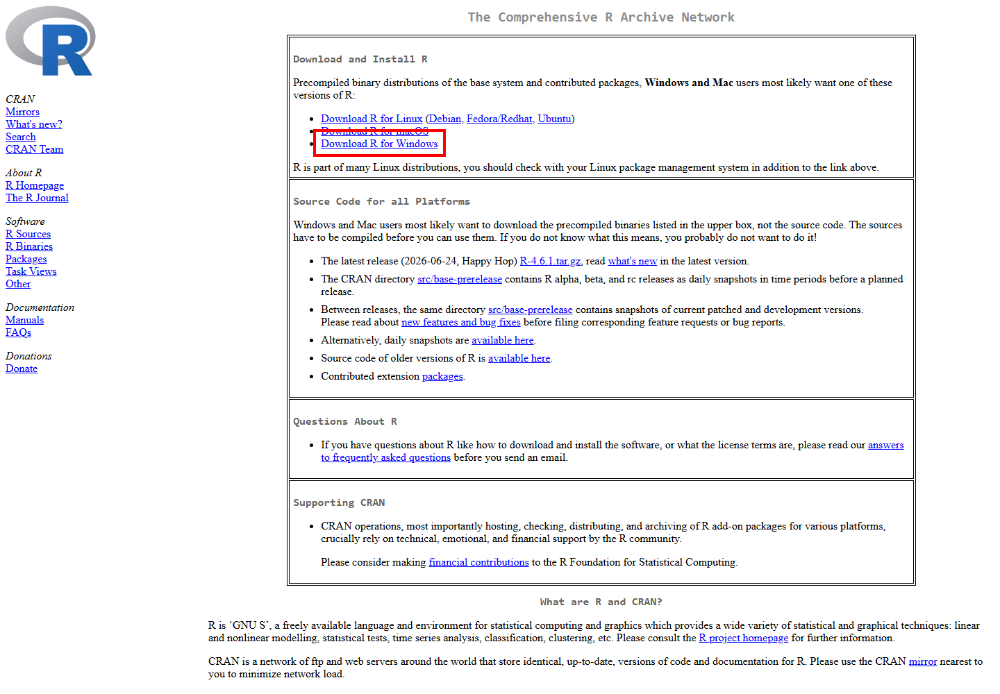
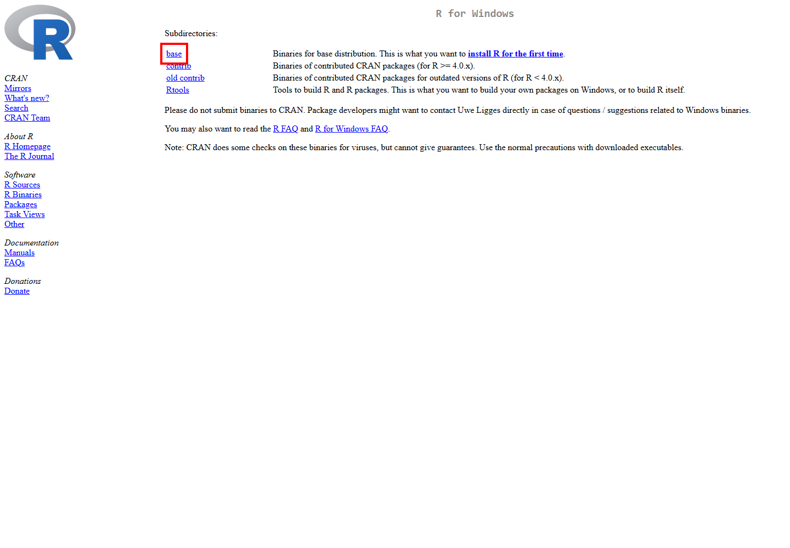
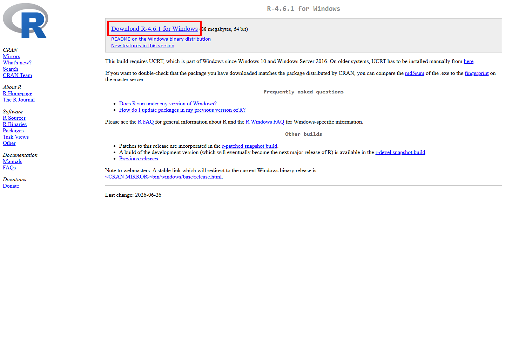
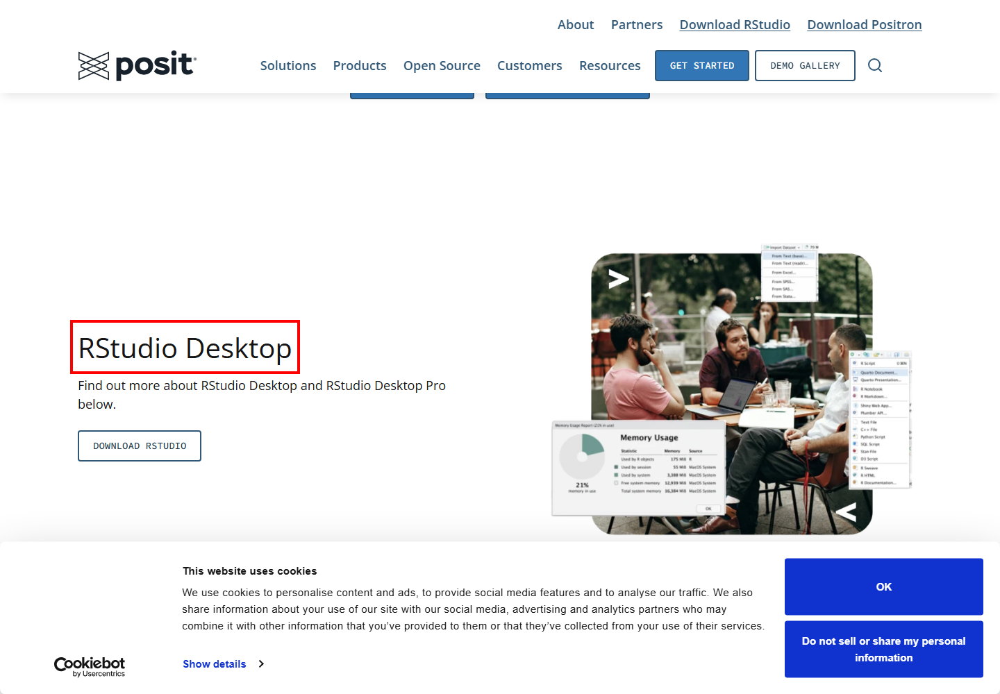
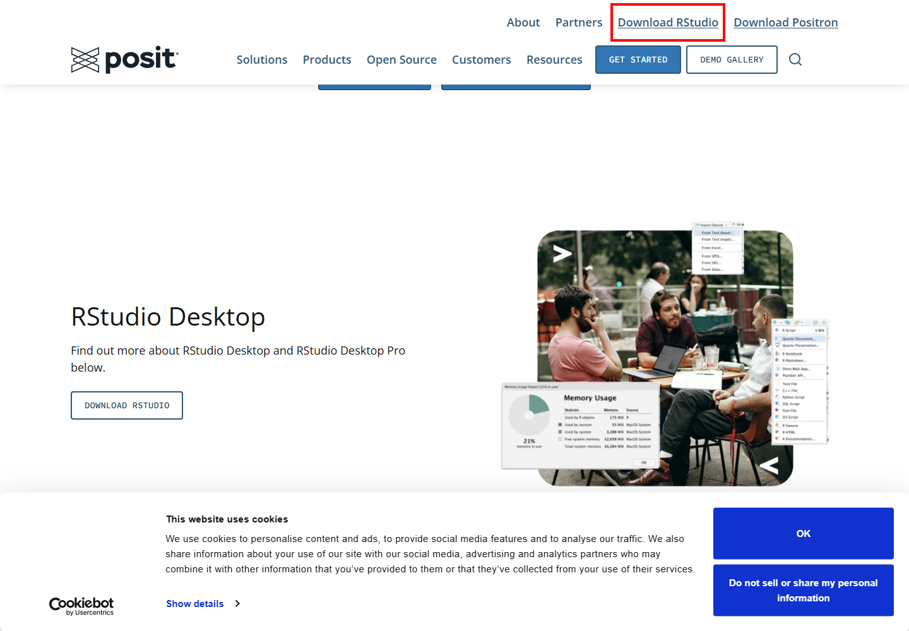

## R과 RStudio란?

R을 처음 사용하는 경우 **R과 RStudio를 모두 설치**하는 것을 권장합니다.

- **R**: 통계분석과 데이터 처리를 실제로 수행하는 프로그램입니다.
- **RStudio**: R 코드를 보다 편리하게 작성하고 실행할 수 있도록 도와주는 통합 개발 환경(IDE)입니다.

> **중요:** RStudio만 설치해서는 R을 사용할 수 없습니다.
> **R을 먼저 설치한 후 RStudio를 설치**합니다.

---

## 설치 순서

1. **R 다운로드 및 설치**
2. **RStudio Desktop 다운로드 및 설치**
3. RStudio 실행
4. 정상 설치 여부 확인

---

# R 설치

## CRAN 접속

R 공식 다운로드 사이트인 CRAN에 접속합니다.

https://cran.r-project.org/



화면에서 **Download R for Windows**를 클릭합니다.

---

## Windows용 R 다운로드

Windows용 페이지로 이동한 뒤 **base**를 선택합니다.



그다음 최신 버전의 R 설치 파일을 다운로드합니다.



> 실제 R 버전 번호는 시점에 따라 달라질 수 있습니다.

다운로드한 `.exe` 파일을 실행합니다.

---

# RStudio 설치

## Posit 다운로드 페이지 접속

RStudio Desktop은 Posit에서 제공합니다.

https://posit.co/downloads/



페이지에서 **RStudio Desktop**의 Open Source Edition을 선택합니다.

---

## RStudio 다운로드

RStudio Desktop 다운로드 영역을 확인합니다.



Windows용 설치 파일을 다운로드하여 실행합니다.

대부분 기본값으로 설치하면 됩니다.

**Next → Next → Install → Finish**

---

# RStudio 실행

설치가 끝나면 Windows 시작 메뉴에서 **RStudio**를 검색해 실행합니다.

RStudio가 정상 실행되면 일반적으로 다음 영역을 볼 수 있습니다.

| 영역                            | 주요 기능                         |
| ------------------------------- | --------------------------------- |
| Source                          | R 코드 작성                       |
| Console                         | R 명령 실행 및 결과 확인          |
| Environment                     | 생성한 데이터와 객체 확인         |
| Files / Plots / Packages / Help | 파일, 그래프, 패키지, 도움말 확인 |

---

# 정상 설치 확인

Console에 다음 코드를 입력합니다.

```r
1 + 1
```

다음 결과가 나오면 정상입니다.

```text
[1] 2
```

R 버전 확인:

```r
R.version.string
```

---

# 간단한 R 코드 실행

```r
x <- c(10, 20, 30, 40, 50)

mean(x)
```

코드를 선택한 후 `Ctrl + Enter`를 누르면 실행됩니다.

---

# 패키지 설치

```r
install.packages("dplyr")
```

사용할 때:

```r
library(dplyr)
```

또는:

```r
install.packages("tidyverse")
library(tidyverse)
```

---

# 설치 주소 요약

| 프로그램        | 공식 다운로드 주소          |
| --------------- | --------------------------- |
| R               | https://cran.r-project.org/ |
| RStudio Desktop | https://posit.co/downloads/ |

---

# 설치 흐름 요약

```text
① CRAN 접속
   ↓
② R 다운로드 및 설치
   ↓
③ Posit 접속
   ↓
④ RStudio Desktop 다운로드 및 설치
   ↓
⑤ RStudio 실행
   ↓
⑥ Console에서 1 + 1 실행
   ↓
⑦ [1] 2가 나오면 완료
```
