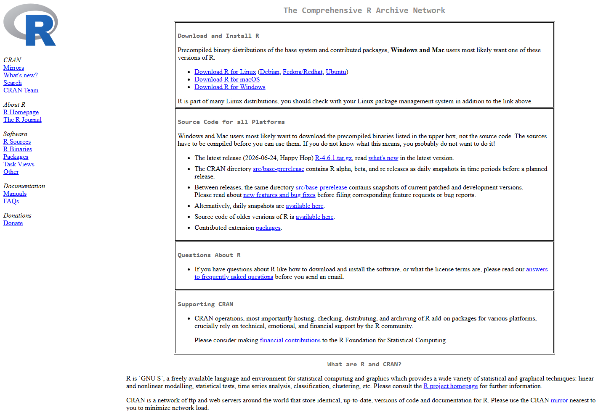

# 웹사이트 자동 캡처 사용법

이 저장소의 `capture_screenshots.py`는 Playwright를 이용해 R 및 RStudio 공식 웹사이트의 주요 화면을 자동으로 캡처합니다.

## 1. Python 설치 확인

터미널 또는 PowerShell에서 다음을 실행합니다.

```bash
python --version
```

버전이 표시되면 사용할 수 있습니다.

---

## 2. Playwright 설치

```bash
pip install playwright
```

그다음 Chromium 브라우저를 설치합니다.

```bash
playwright install chromium
```

---

## 3. 자동 캡처 실행

GitHub 저장소 폴더에서 다음을 실행합니다.

```bash
python capture_screenshots.py
```

실행이 끝나면 `images` 폴더에 다음 파일들이 생성됩니다.

```text
images/
├── 01_cran_home.png
├── 02_r_windows.png
├── 03_r_download.png
├── 07_posit_downloads.png
└── 08_rstudio_download.png
```

Markdown 문서에서는 다음과 같이 사용합니다.

```markdown

```

---

## 4. Windows 설치 화면은 어떻게 하나?

R 또는 RStudio의 `.exe` 설치 프로그램 화면은 브라우저가 아니므로 Playwright로 캡처할 수 없습니다.

이 화면은 Windows의 캡처 도구를 이용해 직접 캡처한 뒤 `images` 폴더에 저장하는 것을 권장합니다.

예:

```text
04_r_installer_language.png
05_r_installer_path.png
06_r_installer_finish.png
09_rstudio_installer.png
10_rstudio_finish.png
```

---

## 5. GitHub에 업로드

이미지를 새로 만들었으면 다음과 같이 Git에 반영할 수 있습니다.

```bash
git add .
git commit -m "Update R installation screenshots"
git push
```

GitHub 웹사이트에서 직접 파일을 업로드해도 됩니다.

---

## 6. 페이지 구조가 바뀌었을 때

CRAN 또는 Posit 사이트가 개편되면 특정 요소를 찾는 부분이 작동하지 않을 수 있습니다.

그 경우 `capture_screenshots.py`에서 URL 또는 `get_by_text()` 부분을 수정하면 됩니다.

예:

```python
rstudio = page.get_by_text("RStudio Desktop", exact=False).first
```

사이트의 표시 문구가 달라지면 `"RStudio Desktop"`을 새 문구로 바꿔주면 됩니다.
